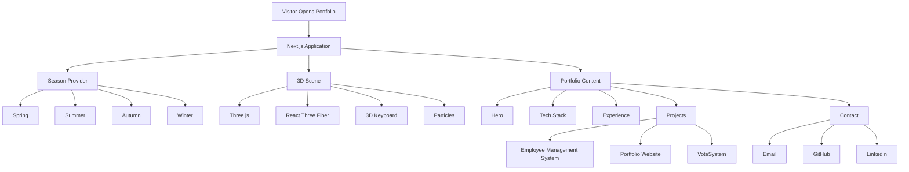

<div align="center">

  <!-- Dynamic Cyber/Slice Header Banner -->
  

  <!-- High-Tech Neon Typing Showcase -->
  <a href="https://asamofficial-portfolio.vercel.app/" target="_blank">
    
  </a>

  <br/><br/>

  <!-- Interactive Action Buttons -->
  <a href="https://asamofficial-portfolio.vercel.app/" target="_blank">
    
  </a>
  <a href="https://github.com/asam0816/3D-Developer-Portfolio" target="_blank">
    
  </a>
  <a href="https://www.linkedin.com/in/asamofficial16/" target="_blank">
    
  </a>

  <br/><br/>

  <!-- Core Tech Stack & Graphics Frameworks -->
  
  
  
  
  
  

  <br/><br/>

  <!-- Status & Architecture Meta Badges -->
  
  
  
  
  

</div>

---

# 🌌 3D Developer Portfolio

**3D Developer Portfolio** is an immersive, interactive and responsive personal developer portfolio created to showcase my professional experience, technical skills, software projects and development journey through a unique **3D web experience**.

Instead of using a traditional static portfolio layout, the application combines modern frontend development with **WebGL and 3D graphics** to create an interactive mechanical keyboard that represents my technology stack.

The portfolio is built with **Next.js, React, TypeScript, React Three Fiber, Drei, Three.js and Tailwind CSS** and includes smooth scrolling, responsive layouts, seasonal visual themes, interactive project showcases, animated page transitions, custom cursor interactions and production-focused optimizations.

<div align="center">

### 🌐 Live Website

<a href="https://asamofficial-portfolio.vercel.app/">
  
</a>

</div>

---

# 📸 Portfolio Preview

<div align="center">

### 🏠 Hero Section


<br/><br/>

### 💻 Interactive Tech Stack


<br/><br/>

### 💼 Professional Experience


<br/><br/>

### 🚀 Featured Projects


<br/><br/>

### 🤝 Contact Section


</div>

---

# ✨ Main Features

## 🎹 Interactive 3D Mechanical Keyboard

The central visual element of the portfolio is a fully rendered **3D mechanical keyboard**.

It is built using:

```text
React
   ↓
React Three Fiber
   ↓
Drei
   ↓
Three.js
   ↓
WebGL
```

Each keyboard key represents a technology from my development stack.

The 3D keyboard dynamically changes:

* Position
* Rotation
* Scale
* Camera perspective
* Lighting
* Orientation

depending on which section of the portfolio the visitor is viewing.

---

# 🧑‍💻 Interactive Technology Keys

The keyboard contains technologies including:

<div align="center">


<br/>


<br/>


</div>

The portfolio currently highlights technologies such as:

```text
JavaScript
TypeScript
HTML5
CSS3
Tailwind CSS
Python
React.js
Next.js
Vue.js
Node.js
PHP
Odoo
PostgreSQL
Docker
Git
```

On desktop devices, visitors can interact directly with the technology keyboard.

On mobile devices, the site uses a responsive alternative presentation to maintain usability and performance.

---

# ❄️🌸☀️🍂 Seasonal Theme System

One of the main visual features of the portfolio is its **four-season theme engine**.

Users can dynamically switch between:

```text
🌸 Spring
☀️ Summer
🍂 Autumn
❄️ Winter
```

Changing a season updates multiple aspects of the application, including:

* Background colors
* Accent colors
* Typography colors
* UI elements
* Keyboard color
* 3D scene appearance
* Particle effects
* Lighting atmosphere
* Interactive controls

The selected season is managed through a dedicated React provider.

---

# 🌌 Animated Background

The portfolio includes an immersive animated background containing floating particles and atmospheric visual effects.

The background responds to the active season so the visual environment remains consistent with the selected theme.

```text
Season Selection
      ↓
Season Provider
      ↓
Color Palette
      ↓
Background
      +
Particles
      +
3D Keyboard
      +
Interface
```

---

# 🧊 Dynamic 3D Scene

The 3D keyboard does not remain static.

As visitors navigate through the website, the keyboard smoothly transitions between predefined states.

For example:

```text
Hero
  ↓
Technology Stack
  ↓
Experience
  ↓
Project 01
  ↓
Project 02
  ↓
Project 03
  ↓
Contact
```

Each section can use different:

* Yaw
* Pitch
* Roll
* X position
* Y position
* Z position
* Scale

This creates the effect of one continuous 3D environment throughout the portfolio.

---

# 🖱️ Custom Cursor

Desktop visitors receive a custom interactive cursor.

The cursor responds differently when hovering over interactive elements such as:

* Buttons
* Links
* Technology keys
* Project cards
* Navigation controls

This helps give the website a more immersive application-like feel.

---

# 🧲 Magnetic Interactions

Interactive buttons use **magnetic target behaviour**.

When the cursor approaches supported elements, the interface creates a subtle magnetic attraction effect.

This improves the premium feel of:

* CTA buttons
* Social links
* Project actions
* Navigation controls

---

# 🧭 Section Navigation

A fixed vertical navigation system allows visitors to quickly move between important sections of the portfolio.

Sections include:

```text
HOME
  ↓
STACK
  ↓
EXPERIENCE
  ↓
PROJECT 01
  ↓
PROJECT 02
  ↓
PROJECT 03
  ↓
CONTACT
```

The currently visible section is automatically detected and highlighted.

---

# 📊 Scroll Progress Indicator

A thin animated progress bar at the top of the viewport indicates how far the visitor has moved through the portfolio.

```text
0% ━━━━━━━━━━━━━━━━━━━━━━━━━━━ 100%
```

The progress is calculated from the document scroll position and updated efficiently using `requestAnimationFrame`.

---

# 🌊 Smooth Scrolling

The site integrates **Lenis** for smooth scrolling.

This improves navigation between:

* Hero
* Tech Stack
* Experience
* Projects
* Contact

and contributes to the cinematic movement of the 3D environment.

---

# ✨ Reveal Animations

Content sections use scroll-triggered reveal animations.

Elements can animate into view from different directions while supporting configurable:

* Animation delay
* Duration
* Direction
* Distance

These effects are designed to enhance the experience without overwhelming the content.

---

# 📱 Responsive Design

The portfolio is designed for both desktop and mobile users.

```text
Desktop
   ↓
Full Interactive WebGL Experience
   ↓
3D Mechanical Keyboard
   ↓
Custom Cursor
   ↓
Interactive Navigation
```

On smaller devices:

```text
Mobile
   ↓
Optimized Interface
   ↓
Reduced Heavy Interactions
   ↓
Static Technology Grid
   ↓
Touch-Friendly Controls
```

This ensures the portfolio remains usable even when WebGL-heavy interactions would not be suitable.

---

# 📂 Project Showcase System

Projects are displayed through dedicated showcase sections.

Each project can contain:

* Project number
* Project title
* Technology stack
* Short description
* Detailed description
* Project status
* Live project URL
* Screenshots
* Project modal
* Image carousel

---

# 🚀 Featured Projects

## 🏢 Project 01 — Employee Management System

**Status:** ✅ Complete

A comprehensive HR management SaaS application designed for modern organizations.

It provides a centralized workspace for managing:

* Employees
* Attendance
* Departments
* Leave requests
* Payroll
* Payslips
* ID cards
* Audit logs
* Meetings
* Employee settings

### Technologies

```text
React.js
Tailwind CSS
Next.js
MongoDB
Inngest
Node.js
Express.js
GitHub
```

### Live Application

<a href="https://techtitans-ems.vercel.app/">
  
</a>

---

## 🌐 Project 02 — Portfolio Website

**Status:** ✅ Complete

A modern portfolio website built to showcase my development skills, education, experience and projects through a clean and responsive user interface.

The project includes:

* Responsive layout
* Modern UI
* Glassmorphic design
* Dark theme
* Project showcase
* Skills section
* Education section
* Experience section
* Contact section

### Technologies

```text
HTML
Tailwind CSS
JavaScript
React.js
```

### Live Application

<a href="https://asamofficial.netlify.app/">
  
</a>

---

## 🗳️ Project 03 — Secure & Transparent VoteSystem

**Status:** 🚧 Ongoing

A secure online voting platform designed for organizations, associations and event organizers.

The system allows administrators to:

* Create election events
* Manage candidates
* Manage users
* Monitor election statistics
* View voting information
* Manage feedback
* View real-time results

The platform includes different access levels for administrators and regular users.

### Technologies

```text
HTML5
CSS3
Tailwind CSS
JavaScript
React.js
TypeScript
GitHub
```

### Live Application

<a href="https://eventvotingsystem.vercel.app/">
  
</a>

---

# 🖼️ Project Modal & Image Carousel

Visitors can open detailed project information without leaving the portfolio.

Each project modal can include:

```text
Project Overview
       ↓
Description
       ↓
Technology Stack
       ↓
Screenshots
       ↓
Image Carousel
       ↓
Live Project
```

The carousel makes it possible to present several application screens in a single project showcase.

---

# 💼 Professional Experience

## Web Developer Intern — Tech Bytz

**June 2025 — December 2025**
**Colombo, Sri Lanka**

During my internship at **Tech Bytz**, I contributed to the development of a comprehensive **Digital Author Portfolio and Book Marketing Management System for Neermai.com**.

The platform was designed to provide authors with a professional digital presence and tools to showcase their profiles, manage publications and promote books online.

### Main Contributions

#### 👤 Author Profile Management

Implemented complete CRUD functionality supporting:

* Author profiles
* Biography sections
* Profile images
* Achievement information

#### 📚 Book Management

Developed functionality for:

* Book uploads
* Book information forms
* Gallery pages
* Category filtering
* Advanced searching

#### 📊 Analytics Dashboard

Implemented systems to monitor:

* Book views
* Engagement metrics
* Content performance
* Graphical analytics

#### ⚙️ Administration

Developed administrative interfaces supporting:

* Author management
* Book management
* Secure authentication
* Content administration

#### 🔍 SEO

Implemented metadata and search optimization functionality to improve discoverability.

### Internship Technology Stack

```text
HTML5
Tailwind CSS
React.js
Next.js
MongoDB
Express.js
```

---

# 🛠️ Technology Stack

## ⚛️ Core Framework

<p>

</p>

| Technology     | Purpose                           |
| -------------- | --------------------------------- |
| **Next.js 16** | Main application framework        |
| **React 19**   | Component-based frontend          |
| **TypeScript** | Type-safe application development |

---

## 🎮 3D & WebGL

<p>

</p>

| Technology            | Purpose                               |
| --------------------- | ------------------------------------- |
| **Three.js**          | WebGL-based 3D rendering              |
| **React Three Fiber** | React renderer for Three.js           |
| **Drei**              | Reusable R3F helpers and abstractions |

The 3D implementation powers:

* Mechanical keyboard
* 3D text
* Lighting
* Environment effects
* Camera scenes
* Transformations
* Interactive technology keycaps

---

# 🎨 Styling

<p>

</p>

```text
Tailwind CSS v4
CSS Custom Properties
Responsive CSS
Season-Based Design Tokens
Animations
Transitions
Gradients
```

---

# 🌊 Interaction & Animation

The application uses:

```text
Lenis
Intersection Observer
requestAnimationFrame
CSS Animations
Three.js Animations
Custom Cursor Logic
Magnetic Interaction Logic
```

---

# 📈 Monitoring & Analytics

The project integrates:

```text
Vercel Analytics
Vercel Speed Insights
```

These tools help monitor production traffic and performance behaviour.

---

# 🔐 Security

The application applies several HTTP security headers through `next.config.ts`.

Implemented headers include:

```text
Strict-Transport-Security
X-Frame-Options
X-Content-Type-Options
Referrer-Policy
Permissions-Policy
```

### Security Benefits

* Helps enforce HTTPS
* Protects against clickjacking
* Prevents MIME-type sniffing
* Reduces referrer information leakage
* Disables unnecessary browser APIs

---

# ⚡ Performance

Several techniques are used to maintain strong performance despite the use of WebGL.

### Optimizations

* Next.js production optimization
* React component architecture
* Responsive WebGL strategy
* Mobile-specific rendering decisions
* Next.js font optimization
* Standalone production output
* Vercel Speed Insights
* Vercel Analytics
* Optimized static assets
* Efficient scroll event processing

---

# 📦 Technology Versions

```text
Next.js                 16.2.4
React                   19.2.4
React DOM               19.2.4
React Three Fiber       9.6.0
React Three Drei        10.7.7
Three.js                0.184.0
Lenis                   1.3.23
Simple Icons            16.16.0
TypeScript              5.x
Tailwind CSS            4.x
```

---

# 📁 Project Structure

```text
3D-Developer-Portfolio/
│
├── app/
│   ├── favicon.ico
│   ├── globals.css
│   ├── layout.tsx
│   └── page.tsx
│
├── components/
│   ├── Carousel.tsx
│   ├── CopyEmail.tsx
│   ├── CustomCursor.tsx
│   ├── FrozenBackground.tsx
│   ├── FrozenKeyboard.tsx
│   ├── LanguageProvider.tsx
│   ├── MagneticTargets.tsx
│   ├── ProjectModal.tsx
│   ├── Reveal.tsx
│   ├── ScrollProgress.tsx
│   ├── SeasonPicker.tsx
│   ├── SeasonProvider.tsx
│   ├── SectionNav.tsx
│   └── smooth-scroll.tsx
│
├── lib/
│   ├── i18n.ts
│   ├── seasons.ts
│   ├── skills.ts
│   └── useIsMobile.ts
│
├── public/
│   │
│   ├── fonts/
│   │
│   ├── projects/
│   │   ├── ems/
│   │   ├── portfolio/
│   │   └── vote/
│   │
│   ├── cv.pdf
│   └── cv_en.pdf
│
├── portfolio images/
│   ├── Screenshot_1.png
│   ├── Screenshot_2.png
│   ├── Screenshot_3.png
│   ├── Screenshot_4.png
│   └── Screenshot_5.png
│
├── .dockerignore
├── .gitignore
├── Dockerfile
├── eslint.config.mjs
├── next.config.ts
├── package.json
├── package-lock.json
├── postcss.config.mjs
├── tsconfig.json
└── LICENSE
```

---

# 🧩 Main Components

## `FrozenKeyboard.tsx`

Responsible for the interactive 3D keyboard.

```text
FrozenKeyboard
      ↓
React Three Fiber Canvas
      ↓
Three.js Scene
      ↓
3D Keyboard
      ↓
Technology Keycaps
      ↓
Section-Based Animation
```

---

## `FrozenBackground.tsx`

Handles the visual background and animated atmospheric particles.

---

## `SeasonProvider.tsx`

Controls the active seasonal theme across the entire portfolio.

---

## `SeasonPicker.tsx`

Provides the four-season interface:

```text
Spring | Summer | Autumn | Winter
```

---

## `ProjectModal.tsx`

Displays detailed information about featured projects.

---

## `Carousel.tsx`

Handles screenshot navigation inside project modals.

---

## `CustomCursor.tsx`

Creates the custom desktop cursor behaviour.

---

## `MagneticTargets.tsx`

Provides interactive magnetic effects for supported buttons and links.

---

## `Reveal.tsx`

Controls scroll-based entrance animations.

---

## `SectionNav.tsx`

Displays vertical navigation and automatically detects the active portfolio section.

---

## `ScrollProgress.tsx`

Displays page scrolling progress at the top of the browser.

---

## `CopyEmail.tsx`

Allows visitors to copy the portfolio email address directly to their clipboard.

If clipboard access fails, the component falls back to opening an email application.

---

# 🔄 Application Flow



---

# 🏗️ Architecture

```text
Browser
   │
   ▼
Next.js App Router
   │
   ├─────────────── React Components
   │
   ├─────────────── Tailwind CSS
   │
   ├─────────────── React Context
   │
   ├─────────────── Lenis
   │
   │
   └── WebGL / 3D Layer
          │
          ├── React Three Fiber
          ├── Drei
          └── Three.js
```

---

# 🚀 Getting Started

## Prerequisites

Make sure your machine has:

```text
Node.js 20+
npm
Git
```

---

# 1️⃣ Clone Repository

```bash
git clone https://github.com/asam0816/3D-Developer-Portfolio.git
```

Move into the project:

```bash
cd 3D-Developer-Portfolio
```

---

# 2️⃣ Install Dependencies

```bash
npm install
```

---

# 3️⃣ Run Development Server

```bash
npm run dev
```

Open:

```text
http://localhost:3000
```

The portfolio should now be running locally.

---

# 📦 Available Scripts

## Development

```bash
npm run dev
```

Starts the Next.js development server.

---

## Production Build

```bash
npm run build
```

Creates an optimized production build.

---

## Start Production Server

```bash
npm start
```

---

## Lint

```bash
npm run lint
```

Runs ESLint to detect code-quality issues.

---

# 🐳 Docker Support

The repository includes a production-ready **multi-stage Dockerfile**.

Build the Docker image:

```bash
docker build -t mohamed-asam-portfolio .
```

Run it:

```bash
docker run -p 3000:3000 mohamed-asam-portfolio
```

Then open:

```text
http://localhost:3000
```

---

# 🐳 Docker Architecture

```text
node:22-alpine
      ↓
Dependencies Stage
      ↓
npm ci
      ↓
Builder Stage
      ↓
Next.js Production Build
      ↓
Standalone Output
      ↓
Minimal Runtime Container
      ↓
Non-Root Next.js User
      ↓
Port 3000
```

The production image runs using a dedicated non-root user rather than `root`.

The Docker configuration also includes a health check for the running web application.

---

# ☁️ Deployment

## Vercel

The production portfolio is currently deployed on **Vercel**.

### Live URL

```text
https://asamofficial-portfolio.vercel.app/
```

<div align="center">

<a href="https://asamofficial-portfolio.vercel.app/">
  
</a>

</div>

---

# 📊 Vercel Analytics

The application integrates:

```text
@vercel/analytics
@vercel/speed-insights
```

This provides production monitoring for:

* Website usage
* Performance
* Core user experience metrics
* Deployment performance insights

---

# 🎨 Theme Architecture

The seasonal interface is controlled using reusable palette objects.

Conceptually:

```typescript
type Season = {
  id: "spring" | "summer" | "autumn" | "winter";
  accent: string;
  keyboardBase: string;
  particle: string;
  particleHalo: string;
};
```

This makes the theme engine centralized and maintainable.

---

# 🌍 Language

The current version of the portfolio is designed as an:

```text
English-Only Portfolio
```

The application maintains a lightweight internal text dictionary for centralized UI copy without introducing an external internationalization dependency.

---

# 📄 Resume / CV

The repository contains downloadable CV files:

```text
public/cv.pdf
public/cv_en.pdf
```

The portfolio provides a **Download CV** button that downloads the resume directly from the website.

---

# 📬 Contact Features

Visitors can contact me using:

* Direct email
* Copy email
* LinkedIn
* GitHub

The email used by the portfolio is:

```text
asamofficial16@gmail.com
```

---

# 🔧 Customizing the Portfolio

## Change Personal Information

The primary portfolio information can be edited inside:

```text
app/page.tsx
lib/i18n.ts
app/layout.tsx
```

---

## Add Another Project

Add a new object to the `projects` array inside:

```text
app/page.tsx
```

Example:

```typescript
{
  num: "04",

  name: "My New Project",

  stack: [
    "Next.js",
    "TypeScript",
    "MongoDB"
  ],

  desc:
    "Short description of the project.",

  details:
    "A more detailed explanation of the application.",

  url:
    "https://project-url.com",

  media: [
    "/projects/project-name/screenshot-1.png",
    "/projects/project-name/screenshot-2.png"
  ],

  badge:
    "Complete",

  align:
    "right",

  section:
    "project4"
}
```

---

# 🖼️ Add Project Screenshots

Create a folder inside:

```text
public/projects/
```

For example:

```text
public/projects/my-project/
```

Add images:

```text
screenshot-1.png
screenshot-2.png
screenshot-3.png
```

Then reference them from the project object:

```typescript
media: [
  "/projects/my-project/screenshot-1.png",
  "/projects/my-project/screenshot-2.png",
  "/projects/my-project/screenshot-3.png"
]
```

---

# 🎨 Customize Seasonal Themes

Theme configuration is located in:

```text
lib/seasons.ts
```

Current themes:

```text
spring
summer
autumn
winter
```

Global theme-related CSS is maintained in:

```text
app/globals.css
```

---

# 💻 Customize Technology Keyboard

The 3D keyboard skills are configured in:

```text
lib/skills.ts
```

Current layout:

```text
┌────────────┬────────────┬───────┬─────┬──────────┐
│ JavaScript │ TypeScript │ HTML5 │ CSS │ Tailwind │
├────────────┼────────────┼───────┼─────┼──────────┤
│ Python     │ React      │ Next  │ Vue │ Node.js  │
├────────────┼────────────┼───────┼─────┼──────────┤
│ PHP        │ Odoo       │ SQL   │Docker│ Git     │
└────────────┴────────────┴───────┴─────┴──────────┘
```

---

# 🔒 Security Headers

The project configures the following HTTP response security headers:

### HSTS

```text
Strict-Transport-Security
```

Helps browsers enforce HTTPS connections.

### Clickjacking Protection

```text
X-Frame-Options: DENY
```

Prevents the portfolio from being embedded inside unauthorized frames.

### MIME Sniffing Protection

```text
X-Content-Type-Options: nosniff
```

### Referrer Protection

```text
Referrer-Policy: strict-origin-when-cross-origin
```

### Browser Permissions

The application disables unnecessary browser permissions including:

```text
Camera
Microphone
Geolocation
Payment
```

---

# 📱 Responsive Behaviour

The website detects smaller screen sizes and adjusts the experience accordingly.

Desktop users receive:

```text
Full 3D Keyboard
Custom Cursor
Magnetic Interactions
Section Navigation
Interactive Key Hovering
```

Mobile users receive a simplified experience designed to reduce WebGL overhead and improve usability.

---

# 🎯 Project Objectives

The purpose of this project is to demonstrate my skills in:

* Modern React development
* Next.js application architecture
* TypeScript
* 3D web development
* WebGL
* React Three Fiber
* Three.js
* Responsive web design
* User interface design
* Animation
* Component architecture
* Frontend optimization
* Deployment
* Docker
* Security configuration
* Performance monitoring
* Git and GitHub

---

# 🌟 Portfolio Highlights

<div align="center">


<br/>


<br/>


<br/>


</div>

---

# 👨‍💻 Developer

<div align="center">

## Mohamed Asam

### Software Engineer | Full Stack Developer

**Bachelor of Computer Science — Software Engineering Graduate**

**KAATSU International University**

<br/>

I am a passionate Full Stack Developer and Software Engineering graduate focused on creating modern, responsive, scalable and user-friendly web applications.

My development experience covers frontend and backend technologies, including **React.js, Next.js, JavaScript, TypeScript, Node.js, Express.js, MongoDB, MySQL, Vue.js, Python, PHP and modern UI frameworks**.

I am particularly interested in developing:

`Full Stack Applications` • `SaaS Platforms` • `ERP Systems` • `Authentication Systems` • `Modern Web Experiences`

<br/>

<a href="https://asamofficial-portfolio.vercel.app/">
  
</a>

<a href="https://github.com/asam0816">
  
</a>

<a href="https://www.linkedin.com/in/asamofficial16/">
  
</a>

<a href="mailto:asamofficial16@gmail.com">
  
</a>

</div>

---

# 🤝 Contributions

Suggestions and improvements are welcome.

To contribute:

### 1. Fork the repository

### 2. Create a branch

```bash
git checkout -b feature/your-feature
```

### 3. Commit changes

```bash
git commit -m "Add new feature"
```

### 4. Push branch

```bash
git push origin feature/your-feature
```

### 5. Create a Pull Request

---

# 📜 License

This project is licensed under the **MIT License**.

See:

```text
LICENSE
```

for additional information.

---

# ⭐ Support This Project

If you like the portfolio or find the implementation useful, consider giving the repository a **GitHub Star ⭐**.

<div align="center">

<a href="https://github.com/asam0816/3D-Developer-Portfolio">
  
</a>

<a href="https://github.com/asam0816/3D-Developer-Portfolio/fork">
  
</a>

</div>

---

# 📬 Let's Work Together

<div align="center">

### Have a project, opportunity or idea you'd like to discuss?

I'm always interested in discussing software development opportunities, collaborations and interesting projects.

<br/>

<a href="mailto:asamofficial16@gmail.com">
  
</a>

<a href="https://www.linkedin.com/in/asamofficial16/">
  
</a>

<a href="https://asamofficial-portfolio.vercel.app/">
  
</a>

</div>

---

<div align="center">

## 💜 Code. Create. Build. Improve.


<br/><br/>


<br/><br/>

### © 2026 Mohamed Asam

<br/>


</div>
